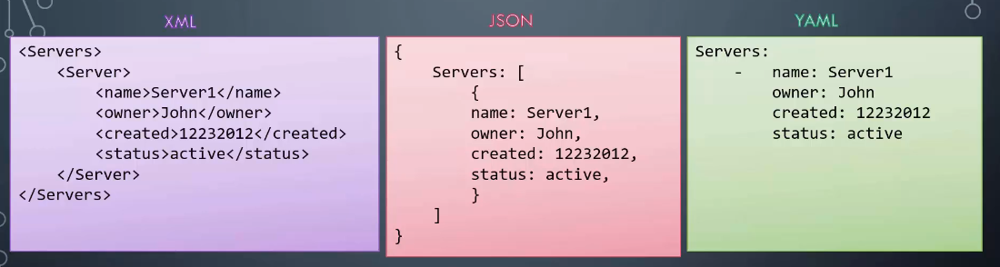

# DF300

## Expression Stages

### $project

* Good for creating brand new fields or renaming fields
* Only sends new fields you specify from one stage to the next

### $set

* $set is very similar to project, but the major difference is that $set will forward ALL of the fields of the document as well as the ones you $set
* From a performance perspective, the instructor said that $project is not necessarily faster than $set even though you are likely returning less fields in $project

### $group

* Roughly equivalent to GROUP BY in SQL
* Groups documents by a "group key"
* Output is one document per group
* Additional fields can contain results of accumulator expressions

<figure><figcaption></figcaption></figure>

* Common $group accumulators
  * $addToSet, $avg, $first, $last, $max, $min, $mergeObjects, $push, $stdDevSamp, $sum
  * Also.. $bucket, $bucketAuto, $facet
    * $bucket is good to segregate data
      * ex. Group data by month
  * $sortByCount
    * Really common for DBAs and developers
    * Returns a frequency count of a field across all of your documents
  * $unwind
    * Opposite of $group, it will unwind an array into multiple documents with the same \_id
      * Because this is a stage during the pipeline in memory, this does not cause any issues

### $lookup

* Like a left outer join, but much more closely aligns to a nested select in terms of performance
  * MongoDB is NOT a relational database!
* Good for analytic purposes mostly
  * Their is one edge case that is acceptable in OLTP applications..
    * ex. When one collection is very static and another is extremely active (updates every few milliseconds)
* No referential integrity is enforced with this operation
* If their is more than one match on the right side of the join, it will put the results into an array
* For each document in the left side of the join, you will have to iteratively scan the right side collection
  * You MUST index the foreign field (right side)
  * It is also recommended to index the local field (left side)
* If their is no match, their is nothing to attach the join to and thus that field will not be attached
* Be careful of cross joining NULL values as NULL is considered a value in Mongo

## Output Stages

### $out

* Write results to a new collection

### $merge

* Update an existing collection
  * Add new documents or edit existing
* Updates existing fields or appends new ones

### $set

* Add extra fields without $projecting all of them

### $replaceRoot

* Create a whole new shape of top-level document
* Very similar to $merge, but $replaceRoot will just fully replace the document
* \_id remains the same

### $sample

* Choose a random set of docs from the input

## Database Internal Stats Stages

Requires elevated permissions to access diagnostic information

* $collStats
  * Describe collection statistics
* $currentOp
  * List ongoing database operations
* $indexStats
  * Are people actually using indexes since boot
* $listSessions
  * Show ho is connected and what are they doing
* $planCacheStats
  * Show what query shapes are cached and the query plans

## Aggregation Optimization

Common mistakes:

* Often developers will think that $project reduces the fields outputted into the next stage, but Mongo will actually use the entire document throughout the pipeline
  * Generally speaking, $project should be towards the end
    * This doesn't actually have any performance impact, but it makes it clear that their is no advantage to putting it at the beginning
* Stages can be streaming or blocking
  * A blocking stage will block subsequent streaming stages

## Aggregation and Memory Usage

* Documents inside the pipeline can be up to 64mb in size
* Final stage must be 16mb or less as they need to be BSON
  * This can be broken during the pipeline/computation phase, but at the end of the process you have to be under 16mb
* Blocking stages can use up to 100mb of heap RAM
  * If you need more, you can write to disk
    * $sort, $group, $bucket, and $bucketAuto can use disk with allowDiskUse:true
      * **WARNING: THIS WILL INCREASE IOPs FOR THE ENTIRE DATBASE AND IT SHOULD BE AVOIDED AT ALL COSTS IN PRODUCTION**
      * You can see this in db.currentOp and in the explain plan look for that specific type of operation

## Schema Validation

<figure><figcaption></figcaption></figure>

* Moderate validation allows documents out of validation to stay out of validation
* Strict validation does not retroactively reapply to everything on disk
* The rules are applied on new updates&#x20;

## Change Streams

* Reads from the op log
* Listen for writes to a collection, database, or instance
  * Filter notifications we want to receive
  * On notification, receive the delta or whole document (before or after change)
  * Can stop listening and resume where we left off
* Drivers handle change stream differently
  * Some block until an event with or without a timeout
    * For C#, the default is technically blocking, but if you have an async methodology you can change that
    * Atlas triggers uses this same technology
  * Some allow to ask if there are any changes or not by setting timeout zero
  * Provide a function to be called if there are changes

## Sessions

* Support retryable writes and causal consistency
  * Diff than eventual consistency.. in mongo things have to occur in the correct order
* Logical server sessions that can be synchronized between clients
  * Sessions are kept track of on the database side
* Allows them to have the same causal view of the world
  * Allows read your own writes
    * findOneAndUpdate()
  * One sessions knows another's writes have completed
  * Allows retryable writes - ability to safely auto-retry a failover
  * Underpin transaction handling
* Ultimately sessions revolve around a defined timestamp in the internal operation log

## Retryable Read and Writes

* Retryable writes automatically retry a write in the event of HA failover
  * Default for 4.2+ drivers and Atlas connection strings
  * Operations can be made idempotent but a simple $inc:{a:1} isn't
  * Retryable writes, with implicit sessions are able to ensure things happen once
  * Waits until the cluster is available then repeats the single write
  * Checks that the newly elected Primary has not already seen the operation
* Retryable reads redo a read sent to a server if that if that server fails before responding
  * Does not apply to getmore operations
* If a secondary goes down and comes back up, it will automatically recover itself

## Multi-Document Transactions

* Most locking occurs at the document level
* Enable full ACID properties in MonogDB
  * Snapshot level isolation
  * Require at least a replica set
  * Work across sharded clusters from MongoDB 4.2 (distributed data)
* Be aware transactions should not be the default approach
  * Can introduce contention
  * Might be used for <1% of update operations or less
* Correct schema design often provides a simpler, more efficient solution
* The majority of MongoDB developers do not use Transactions
* Deadlocks do occur in Mongo
  * The second transaction is always the one that is deadlocked
* Writes block writes, but not other reads
