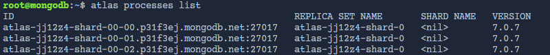

# Discovery Call

Before the call

* Do background research on the company and check out the existing website

Step 1

* Ask the client what they hope a new website will do for their company
  * Does the client want more leads?
  * More sales?
* Never make an assumption
* Ask them what the goal is and you should **advise them** on how to achieve that goal
* Most people don't fully understand the power of a website and simply view a website as a brochure
  * Help them think bigger
* One of the goals is to be seen as a trusted advisor
  * Once the website is done, they will no longer have a use for you
* Flags to look out for...
  * Somebody who thinks they are an expert

Step 2

* Probe for more details and be specific
* Lets say the client says "I just want more leads"
  * You might want to respond with "How many leads would you like the website to bring in every week? month?"
    * This gives you a good idea of how easy/hard it will be, give you an opening to talk numbers, let's you know how realistic their expectations are
    * If they say they want 50 leads a month you can ask how many leads does it typically take to close a sale along with the average price of sale when someone buys
    * Tip: acknowledge the fact that leads don't pay the bills!
* If the website you build helps them generate $50k per month, factor that in
* "50 leads is a makable target, for sure. Do you already have a plan for how you're going to drive the traffic needed to hit that goal or is that something you would like help with?"
  * Upsell!

Step 3

* Qualify them by throwing out a budget range and see if they flinch
* The sooner you talk price the better!
* "We can design a website and digital marketing plan that get your company 50 leads a month, which sounds like it would generate 50k/month, I am confident about that.. my question is about budget..."
  * If it sounds like they have a low budget, you must NOT go below your minimum
* "our minimum is $5000 to build a new website, does that feel low or high to you?
  * Never ask a client for their budget
  * If they have an established business with money, go with the "price bracketing" approach of throwing out a range
    * "the last few sites we did that are similar to what you're wanting were between $10,000 and $20,000. Is that within the range you were thinking?"
    * The range needs to coincide with the scope of the website they're wanting based on prior research
* Keep in mind that you are selling a phase one website to build a good rapport and eventually start doing their marketing
* Once they have established they are okay with the range, your goal is to get a more accurate understanding
  * Ex. lets say the range was 10-20k.. "Perfect. Will we have the full $20,000 to work with or do we need to be on the lower end of that range?"
    * This lets them know that if they are on the lower end of the range then we won't be able to commit as much time, but it is asked in a non-threatening way

Step 4

* Get clear on features and functionality
* Find the technical pieces to their website as those take a lot of time
* If you notice things on their current site is missing, sell them on it!
* Pull up their site on a tool like AHREFs and show them their current SEO status vs their competitors
* If you notice issues with copy, conversion, optimization, UX, etc point those out and talk about how we would fix those issues

Step 5

* "Okay lets talk process and how we're actually going to get this site done for you. There are 7 steps and it's important for you to know that they are so we're on the same page. Most agencies only have 2-3 steps which causes a lot of issues in projects like this
* The first thing we're going to do is discovery, we need to deep dive into your brand, your processes, your services, SEO research, and your competitors
  * This is the key step that most agencies don't do
* The next step is UX design, we put a lot of thought and expertise into the layout of each page by building detailed wireframes
  * This makes design and development smoother and more predictable and it gives you an opportunity to approve layout nad content flow before we actually code anything
* The next step is UI design, we pass off the initial wireframes to our design team and they do the hard work of creating detailed mockups of how your website will actually look and feel
* During the design phase we also start working on copy and content. Copywriting is one of the most important parts of a website and what it says determines whether or not is successful
* Once you've approved the wireframes and the UI design and we're starting to get a solid handle on copy and content, development will go very smoothly
* We ensure your site is built with scalability and accessibility
  * Making it scalable means we can make changes as your business evolves and ensures you are never locked into a template that doesn't allow you to do what you need to such as Wix, Shopify, etc
* Making your website accessible, which most won't do, ensures people with physical or cognitive disabilities&#x20;
  * This helps user experience and it also protects you from **accessibility lawsuits**
* We build our sire on a live URL and allow you to check in whenever you want
* As we wrap up development, we encourage you to make a punch list of things that need to be changed before we push the website to live
* The final step is to continue doing ongoing maintenance and new updates along with a marketing plan
* Let them know that if you just build a website, it will not drive 50 leads a month.. you need to market the site for them and that can easily lead to 1-2k per month
* That's the 7 step process we follow to make sure every site gets you from point A to point B on time, on budget, without fail. Is that more or less involves than you imagine?
  * By saying all of this, you have communicated how much work goes into this
* 

Step 6

* Tell them what the next step is&#x20;
* That next step is a custom proposal that documents a lot of what we talked about, lists every single deliverable in a statement of work and clearly outlines pricing options. Sound good?

The #1 key to a successful discovery call is positive indifference&#x20;

* You're positive in the sense that you are excited about the opportunity, but you're indifferent as to whether or not they end up choosing you

You can not just follow a script or an outline.. it takes experience and practice

